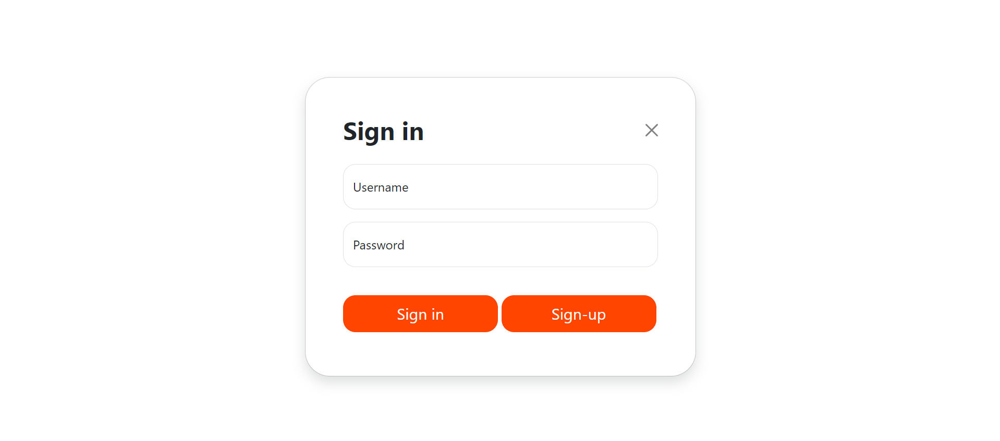
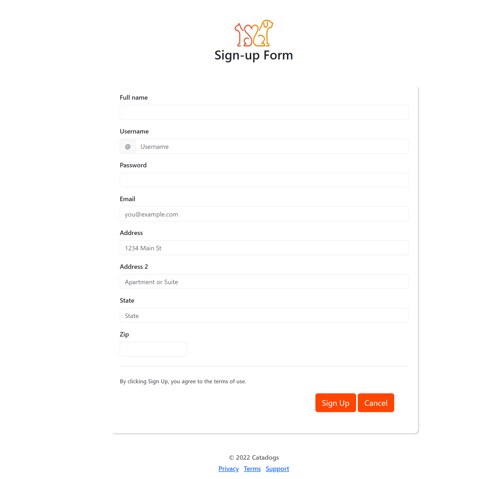
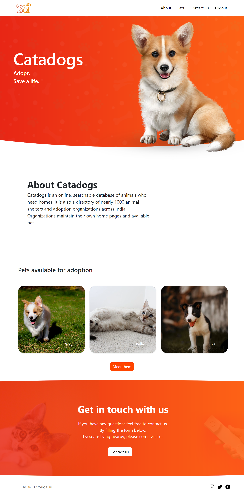
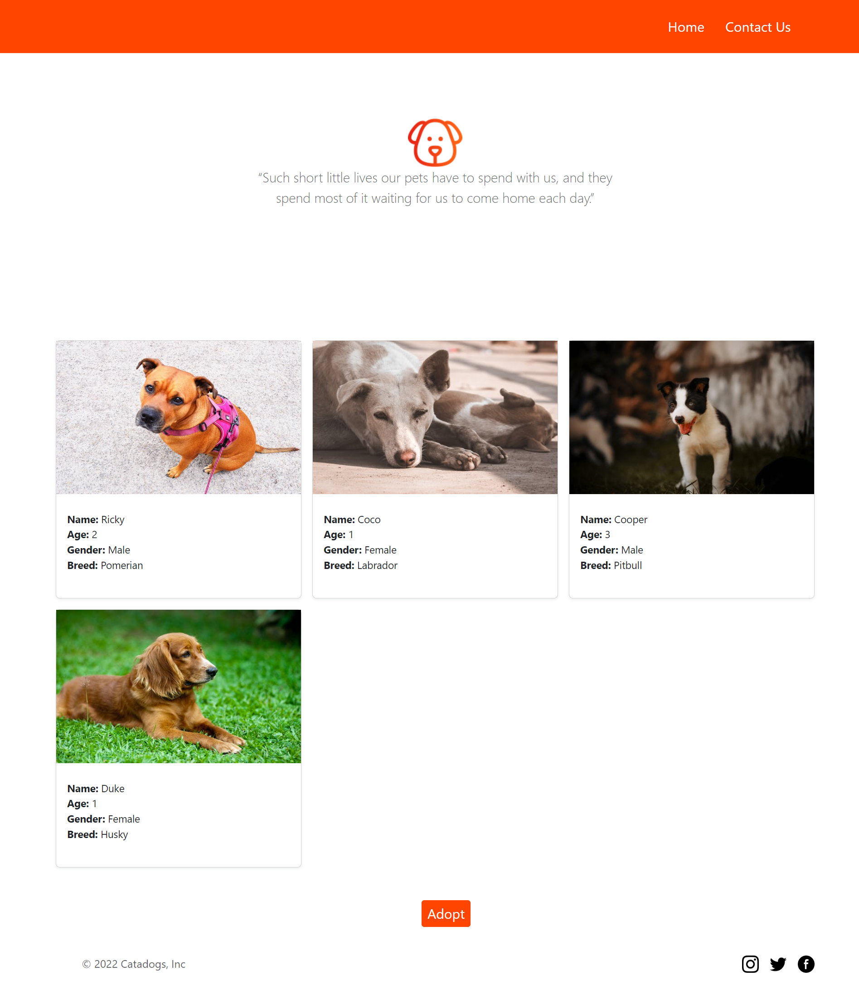
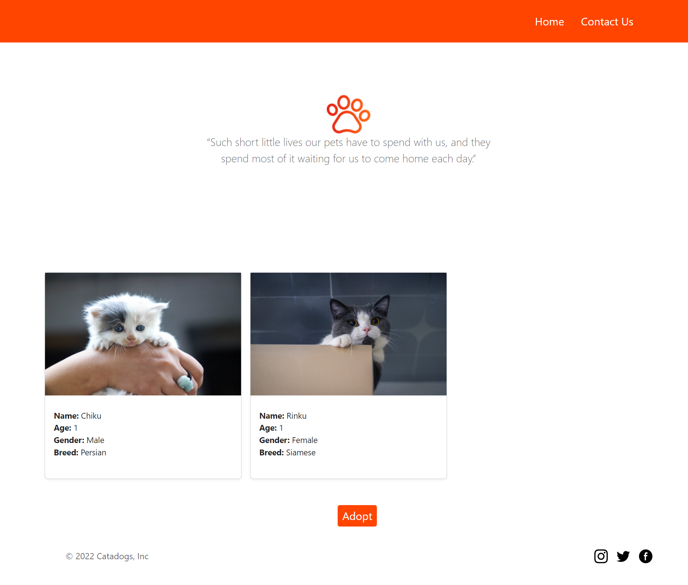
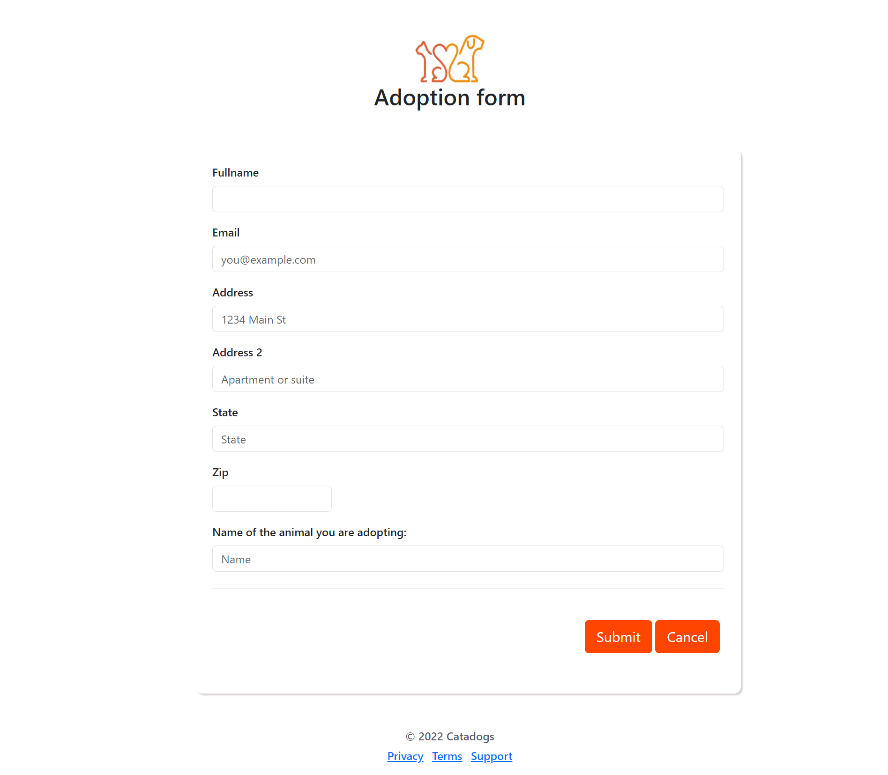
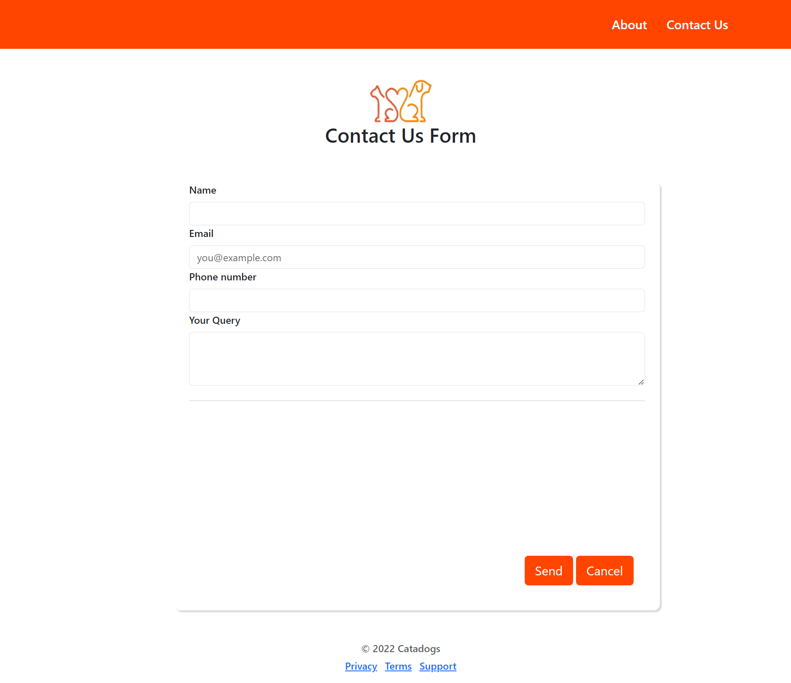
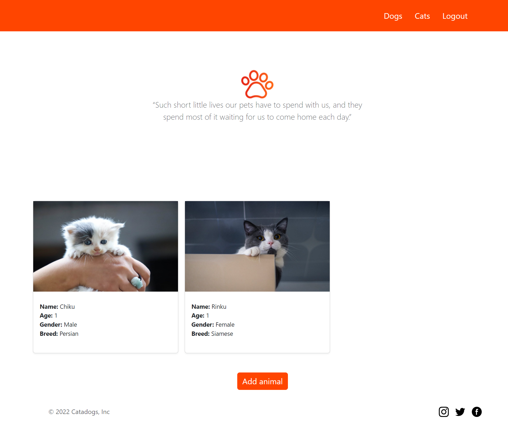

CATADOGS is an animal friendly website created to make the stray animals feel safe and to help out the adoption homes. Separate database is maintained for animals based on categories and user can go through pet details as per their requirement.

The Front-End languages used for building this website are HTML, CSS and JavaScript and the languages used for Back-End are Node.js, Express.js and MongoDB along with the help of EJS templates.

### Getting Started
``` 
    npm install 
    node app.js
```

Open http://localhost:3000 with your browser to see the result.

### SCREENSHOTS:

#### Login and Signup Page:



#### Homepage:


#### Dogs and Cats Adoption Page:



#### Adoption Form:


#### Contact Us Form:


#### Admin Dashboard:



#### ER Diagram:

